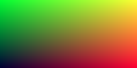

# Java Ray Tracer
Simple ray/path tracer written in Java. Follows Peter Shirley's "Ray Tracing in One Weekend", [which can be found here](https://github.com/petershirley/raytracinginoneweekend)

## Results
### Chapter 1

Hello, World!

### Chapter 2
Set up a simple vector3 class!

### Chapter 3

Set up some logic for interpreting a 3D world, and working with rays.

### Chapter 4

Spheres. **It's spherical!**

### Chapter 5

Initial image mapping surface normals to unique RGB values.

This was really cool to see. It kind of feels like there's more to my scene than just a circle. Took a little extra time to gain a deeper understanding of how surface normals are calculated and how they'll be used for shading.